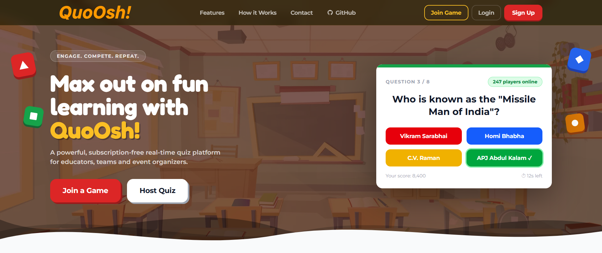
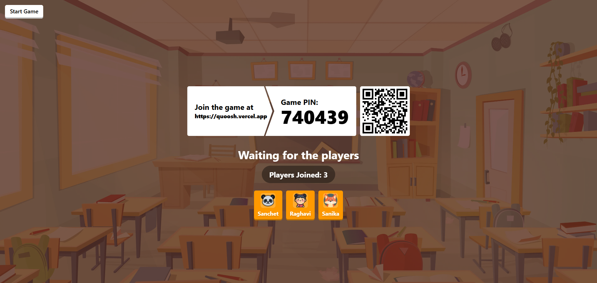

<div align="center">

  

  <p style="margin: 0;">
    <strong>
      A self-hostable, real-time live quiz platform — 
      like Kahoot, but <em>yours</em>.
    </strong>
  </p>

</div>

---

---
<div align="center">

  <h3>
    🌐 <strong>Try it now →</strong>
    <a href="https://quoosh.vercel.app"><b>quoosh.vercel.app</b></a>
  </h3>

</div>

## 📖 Overview

**Quoosh** is an open-source, browser-based live quiz platform built for classrooms, events, and teams. A **host** creates a quiz, starts a live session, and players join instantly using a 6-character PIN — **no account required for players**.

Designed to be **self-hosted**: fork it, configure it, and own your data completely.

### ✨ Key Features

| Feature | Description |
|---|---|
| 🎮 **Real-time Gameplay** | WebSocket-powered with instant score updates and live leaderboards |
| 🤖 **AI Quiz Generator** | Auto-generate quizzes using Google Gemini |
| 📥 **JSON Import** | Bulk-add questions from a structured JSON file |
| 🔐 **Flexible Auth** | Google OAuth + Email/Password via Auth.js |
| 🧑‍💼 **Admin Panel** | Manage hosts, moderate quizzes, view live sessions, post announcements |
| 🛡️ **Rate Limiting** | Optional Upstash Redis-backed sliding-window rate limits |
| 📊 **Session Telemetry** | Per-player, per-question answer tracking in PostgreSQL |
| 📱 **Fully Responsive** | Seamlessly works on desktop, tablet, and mobile |
| ⚡ **No Native App** | Everything runs entirely in the browser |

---
## 🖼️ UI Preview

Explore the core experience of **Quoosh** across both host and player perspectives.

---

### 🎯 Host Dashboard 
<p align="center">
  
</p>

Create, edit, and manage quizzes effortlessly with a fast, intuitive dashboard designed for full control.

---

### 🔑 Player Join 
<p align="center">
  
</p>

Players can instantly join any quiz using a simple 6-character game PIN — no login required.

---

### ⏳ Waiting Room 
<p align="center">
  
</p>

A clean and engaging waiting interface keeps players ready and informed before the game begins.

---

### ⚡ Live Game Play
<p align="center">
  
</p>

Enjoy seamless real-time gameplay with instant responses, dynamic scoring, and a live leaderboard.

---

## 🌐 Deployment

| Service | URL |
|---|---|
| 🌍 Frontend (Vercel) | [https://quoosh.vercel.app](https://quoosh.vercel.app) |
| ⚙️ Backend (Railway) | [https://quoosh-production.up.railway.app](https://quoosh-production.up.railway.app) |

---

## 🏗️ Architecture Overview

Quoosh uses a **split architecture**: an HTTP server for pages and APIs, and a separate long-lived WebSocket process for real-time game state.

```
┌──────────────────────────────────────────────────────────────┐
│                          Internet / LAN                      │
└──────────────┬────────────────────────────────────────┬──────┘
               │ HTTPS                                  │ WSS
               ▼                                        ▼
     ┌──────────────────────┐                 ┌──────────────────────┐
     │  Browser (Host)      │                 │  Socket.IO :3001     │
     │  Next.js pages +     │                 │  packages/socket     │
     │  React client        │◄───────────────►│  Long-lived process  │
     └──────────┬───────────┘                 └──────────────────────┘
                │ HTTP REST /api/*
                ▼
     ┌─────────────────────────┐       ┌──────────────────┐
     │  Next.js 16 — web :3000 │──────►│  PostgreSQL (DB) │
     │  App Router · API routes│       │  Prisma ORM      │
     │  Auth.js session cookies│       └──────────────────┘
     └─────────────────────────┘
                                        ┌──────────────────┐
     ┌──────────────────────┐           │  Upstash Redis   │
     │  Browser (Player)    │──  WSS ──►│  Rate-limiting   │
     └──────────────────────┘           └──────────────────┘

     ┌──────────────────────┐           ┌──────────────────┐
     │  Google OAuth/Gemini │           │  Resend          │
     │  (server-side)       │           │  Contact email   │
     └──────────────────────┘           └──────────────────┘
```

> **Why two processes?**
></br> Next.js API routes run as serverless functions, which can't hold persistent in-memory game state. The Socket.IO server is a dedicated Node.js process that lives as long as the game does.

---

## 🗂️ Monorepo Structure

This project is a **pnpm workspace monorepo** — one repo, multiple packages, shared code via TypeScript path aliases.

```
quoosh/
├── .env.example                 # Copy to .env — never commit .env
├── package.json                 # Root scripts: dev, build, lint, start
├── pnpm-workspace.yaml          # Workspace globs: packages/*
├── tsconfig.json                # Base TS + @quoosh/* path aliases
├── config/
│   ├── game.json                # Manager password, music config
│   └── quizz/                   # Quiz JSON files (generated at host-time)
└── packages/
    ├── common/                  # Shared types + validators
    │   └── src/
    │       ├── types/game/      # socket.ts, status.ts, index.ts
    │       └── validators/      # auth.ts (Zod invite/username validators)
    ├── socket/                  # Real-time game server
    │   └── src/
    │       ├── index.ts         # Socket.IO server + /admin namespace
    │       └── services/        # game.ts, registry.ts, config.ts
    └── web/                     # Next.js app (frontend + API)
        ├── prisma/              # schema.prisma, seed.ts, migrations/
        └── src/
            ├── app/             # App Router: pages + API routes
            ├── components/      # UI components
            ├── contexts/        # SocketProvider
            ├── stores/          # Zustand: player, manager, question
            └── lib/             # auth.ts, db.ts, ratelimit.ts
```

### Package Dependency Graph

```
@quoosh/common  ──────────────────────────── (no internal deps)
@quoosh/socket  ──► @quoosh/common
@quoosh/web     ──► @quoosh/common, Prisma, Next.js, Auth.js, ...
```

---

## 🛠️ Tech Stack

<div align="center">

### Frontend

[](https://nextjs.org)
[](https://react.dev)
[](https://www.typescriptlang.org)
[](https://tailwindcss.com)
[](https://zustand-demo.pmnd.rs)
[](https://zod.dev)

### Backend & Database

[](https://nodejs.org)
[](https://www.postgresql.org)
[](https://www.prisma.io)
[](https://upstash.com)
[](https://socket.io)

### Auth, AI & Infra

[](https://authjs.dev)
[](https://ai.google.dev)
[](https://vercel.com)
[](https://railway.app)
[](https://neon.tech)
[](https://pnpm.io)

</div>

<br />


### 🧰 Core Technologies - Detailed Breakdown
> #### Frontend (`packages/web`)

| Technology | Version | Purpose |
|---|---|---|
| **Next.js** | 16.1.5 | React framework, App Router, SSR |
| **Tailwind CSS** | 4.2.2 | Utility-first styling |
| **Auth.js** (next-auth) | 5.0.0-beta | Sessions, Google OAuth, credentials |
| **Socket.IO client** | ^4.8.3 | Real-time game connection |
| **Zustand** | ^5.0.10 | Global game state |
| **Zod** | ^4.3.6 | Schema + env validation |
| **Motion** | ^12.29.2 | Animations |
| **React Hook Form** | ^7.71.2 | Form state management |
| **@dnd-kit** | ^6–10 | Drag-and-drop quiz builder |
| **AI SDK (Google)** | ^3.0.43 | Gemini quiz generation |
| **react-hot-toast** | ^2.6.0 | Notifications |
| **react-qr-code** | ^2.0.18 | Game invite QR codes |

>#### Backend / API (`packages/web`)

| Technology | Version | Purpose |
|---|---|---|
| **Prisma** | 5.22.0 | ORM + database migrations |
| **PostgreSQL** (Neon) | — | Primary database |
| **Upstash Redis** | ^1.37.0 | Rate limiting (optional) |
| **Resend** | ^6.9.4 | Contact form email |
| **bcryptjs** | ^3.0.3 | Password hashing (cost 12) |

> #### Real-time Server (`packages/socket`)

| Technology | Version | Purpose |
|---|---|---|
| **Socket.IO** | ^4.8.3 | WebSocket game server |
| **esbuild** | ^0.27.2 | Production bundle |
| **tsx** | ^4.21.0 | TypeScript runner (dev) |
| **Zod** | ^4.3.6 | Env validation |

---

## 🗜️ Database Schema

```
                    ┌──────────────┐
                    │     User     │  role: HOST | ADMIN
                    └──────┬───────┘
           quizzes │       │ sessions (as host)
                    ▼       ▼
              ┌─────┴───────┴─────────┐
              │         Quiz          │  status: PENDING | APPROVED | REJECTED
              └───────┬───────────────┘
                      │ 1:N
                      ▼
              ┌───────────────┐
              │   Question    │  answers: String[], solution: Int, order: Int
              └───────┬───────┘
                      │
┌─────────────┐   ┌──────────────┐   ┌────────────────┐
│ QuizSession │───│PlayerSession │───│ PlayerAnswer   │
│ inviteCode  │   │ nickname     │   │ per question   │
└──────┬──────┘   └──────────────┘   └────────────────┘
       │        ┌────────────┐
       └────────│   Report   │  status: OPEN | RESOLVED | DISMISSED
                └────────────┘

┌──────────────┐   ┌──────────────────┐
│ Announcement │──►│  User (admin FK) │
└──────────────┘   └──────────────────┘

┌─────────────────┐
│ PlatformSetting │  key / value (admin-configurable)
└─────────────────┘
```

>### Enums

| Enum | Values |
|---|---|
| `Role` | `HOST`, `ADMIN` |
| `QuizStatus` | `PENDING`, `APPROVED`, `REJECTED` |
| `ReportStatus` | `OPEN`, `RESOLVED`, `DISMISSED` |

---

## 🌊 Game Flow (State Machine)

| Phase | Host sees | Player sees | Trigger |
|---|---|---|---|
| **Lobby** | `SHOW_ROOM` + invite code | Wait screen | `manager:startGame` |
| **Countdown** | `SHOW_START`, `SHOW_PREPARED` | Same | Auto (timers) |
| **Question** | `SHOW_QUESTION` | `SELECT_ANSWER` | Auto |
| **Results** | `SHOW_RESPONSES` (all answers) | `SHOW_RESULT` (rank + points) | Timer ends |
| **Leaderboard** | `SHOW_LEADERBOARD` | Leaderboard | `manager:showLeaderboard` |
| **Next Round** | Next question | Next question | `manager:nextQuestion` |
| **Finish** | `FINISHED` + podium | Podium | Last round ends |

---

## ⚙️ Environment Variables

Copy `.env.example` to `.env` in the repository root.

### Required

| Variable | Description |
|---|---|
| `DATABASE_URL` | PostgreSQL connection string (e.g. Neon) |
| `AUTH_SECRET` | 32-byte hex secret for JWT signing |
| `AUTH_URL` | Canonical site URL, e.g. `http://localhost:3000` |
| `NEXT_PUBLIC_SOCKET_URL` | Public URL of the Socket.IO server |
| `WEB_ORIGIN` | CORS origin for the socket server |
| `ADMIN_SOCKET_SECRET` | Shared secret for admin WebSocket namespace |

### Optional

| Variable | Description |
|---|---|
| `GOOGLE_CLIENT_ID` / `GOOGLE_CLIENT_SECRET` | Enables Google OAuth |
| `GOOGLE_GENERATIVE_AI_API_KEY` | Enables AI quiz generation (Gemini) |
| `UPSTASH_REDIS_REST_URL` / `_TOKEN` | Enables rate limiting |
| `RESEND_API_KEY` | Enables contact form email |
| `NEXT_PUBLIC_APP_URL` | Base URL for sitemap/robots.txt |

---

## 🚀 Quick Start

### Prerequisites

- Node.js **20+**
- pnpm (`npm i -g pnpm`)
- PostgreSQL database (local or [Neon](https://neon.tech))

### Setup

```bash
# 1. Clone the repository
git clone https://github.com/Sanchet237/Quoosh.git
cd Quoosh

# 2. Install all workspace packages
pnpm install

# 3. Configure environment
cp .env.example .env
# Edit .env — set DATABASE_URL, AUTH_SECRET, socket URLs

# 4. Run database migrations and seed admin user
cd packages/web
pnpm exec prisma migrate deploy
pnpm exec prisma db seed
cd ../..

# 5. Start development servers (web + socket)
pnpm dev
```

Open [http://localhost:3000](http://localhost:3000)

**Default admin credentials** (from seed):

| Field | Value |
|---|---|
| Email | `admin@quoosh.local` |
| Password | `Admin@2026` |

### Verify

```bash
# Check database connectivity
curl http://localhost:3000/api/health
# → { "db": "connected" }
```

---

## 📜 Scripts

| Command | Description |
|---|---|
| `pnpm dev` | Start web + socket in development |
| `pnpm dev:web` | Start only the Next.js app |
| `pnpm dev:socket` | Start only the Socket.IO server |
| `pnpm build` | Build all packages |
| `pnpm start` | Start production servers |
| `pnpm lint` | ESLint all packages |
| `pnpm clean` | Remove `node_modules` and `dist` |

### Prisma (run from `packages/web`)

| Command | Description |
|---|---|
| `pnpm exec prisma migrate dev` | Create + apply a migration |
| `pnpm exec prisma migrate deploy` | Apply migrations (production) |
| `pnpm exec prisma studio` | Open Prisma Studio |
| `pnpm exec prisma db seed` | Seed admin user |

---

## 🚢 Deployment

| Service | Platform | Notes |
|---|---|---|
| **Frontend + API** | [Vercel](https://vercel.com) | Set all env vars in project settings |
| **Socket Server** | [Railway](https://railway.app) / Render / Fly | Needs persistent process (not serverless) |
| **Database** | [Neon](https://neon.tech) | Serverless PostgreSQL |
| **Redis** | [Upstash](https://upstash.com) | Optional — enables rate limiting |

**Key deployment checklist:**
- [ ] Set `WEB_ORIGIN` and `NEXT_PUBLIC_SOCKET_URL` consistently
- [ ] Change `ADMIN_SOCKET_SECRET` from default before going public
- [ ] Run `prisma migrate deploy` against production DB
- [ ] Configure Google OAuth redirect URIs in Google Cloud Console

---

## 🤝 Contributing

Contributions are welcome! This project is **open source** and open for improvements.
Contributions are welcome!

If you have ideas, improvements, or bug fixes:
- Open an issue
- Suggest a feature
- Submit a PR

Let’s build Quoosh together 🚀

---

## 📄 License
This project is licensed under the **MIT License**.

You are free to use, modify, and distribute this software with proper attribution.  
See the [`LICENSE`](LICENSE) file for full details.

---

## 👤 Author

</br>
<div align="center">
 

Made with ❤️ by <a href="https://github.com/Sanchet237"><strong>Sanchet Kolekar</strong></a>

⭐ If you like **Quoosh**, consider giving it a star — it helps the project grow!

</div>
<div align="center">
  <a href="https://github.com/Sanchet237">
    
  </a>
  <a href="https://www.linkedin.com/in/sanchet-kolekar-613916331/">
    
  </a>
  <a href="https://www.instagram.com/sanchetkolekar">
    
  </a>
  <a href="https://x.com/Sanchet_237">
    
  </a>
  <a href="mailto:sanchetkolekar.07@gmail.com">
    
  </a>

</div>

---
